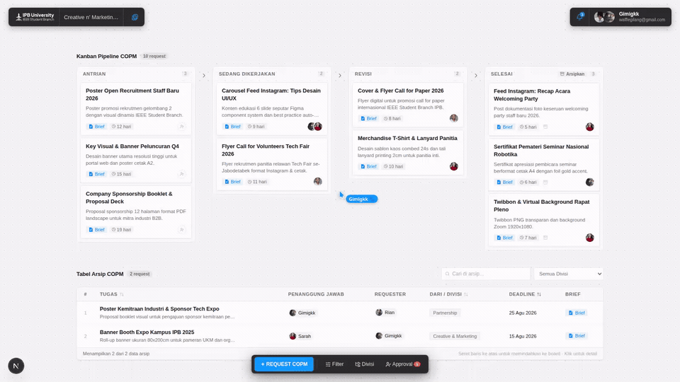
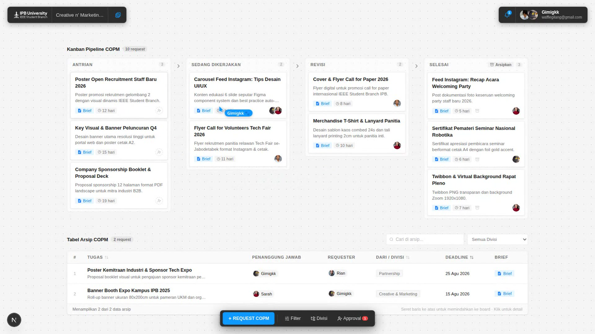
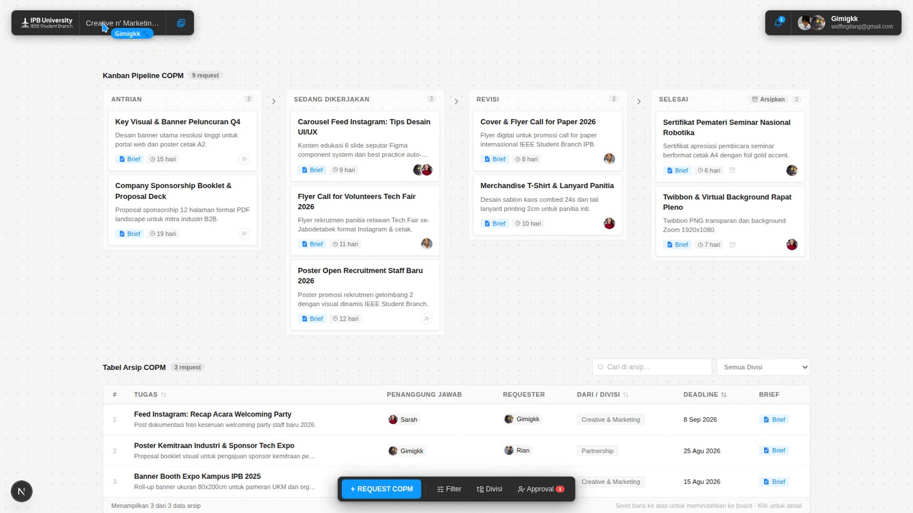
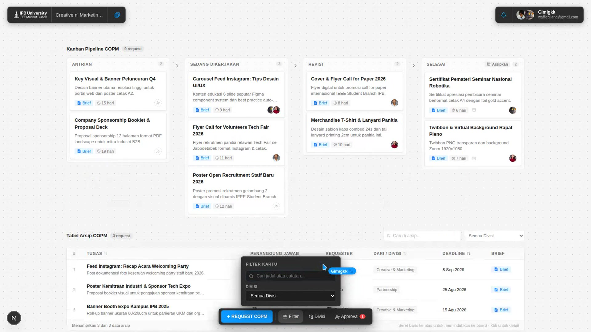
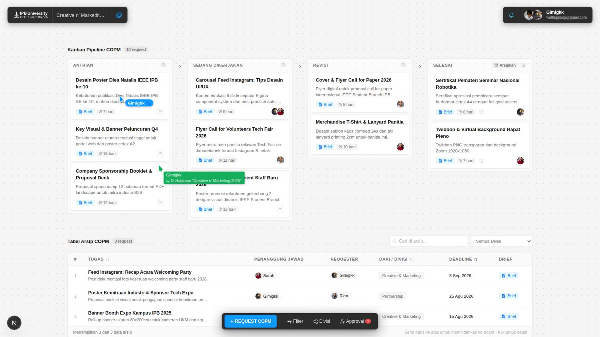

# Center of Publication Media (COPM)

A collaborative Kanban-style publication and design request workflow management platform developed for IEEE SB IPB University.

---

## Showcase



---

## Features

- **Interactive Kanban Pipeline**: Workflow divided into four stages (Antrian, Sedang Dikerjakan, Revisi, Selesai) with drag-and-drop state management.
- **Multi-Workspace Pages**: Seamless switching between organizational divisions and sub-boards.
- **Archive Drop Zone**: Drag completed job cards into the archive table for structured long-term tracking and search.
- **Job Request Workflow**: Standardized form modal with Google Docs brief link auto-detection and metadata assignment.
- **Deliverables Gallery**: Modal preview for reviewing, inspecting, and downloading submitted design assets.
- **Collaborator Presence**: Real-time presence indicators and active workspace badges.
- **Notification System**: In-app notifications for job assignments, revisions, and status updates.
- **Search and Filtering**: Instant client-side search across requestors, assignees, divisions, and deadlines.

---

## Tech Stack

- **Framework**: [Next.js 15](https://nextjs.org/) (App Router, Server Actions)
- **Frontend**: [React 19](https://react.dev/), TypeScript
- **Drag and Drop**: [`@dnd-kit/core`](https://dndkit.com/), `@dnd-kit/sortable`, `@dnd-kit/utilities`
- **Styling**: Vanilla CSS, TailwindCSS
- **Database & ORM**: PostgreSQL / Supabase, [Drizzle ORM](https://orm.drizzle.team/)
- **Icons**: [Lucide React](https://lucide.dev/)

---

## Getting Started

### Prerequisites
- Node.js 18.18+ or later
- npm / pnpm / yarn

### Installation

1. Clone the repository:
   ```bash
   git clone https://github.com/gimigkk/Center-of-Publication-Media.git
   cd COPM
   ```

2. Install dependencies:
   ```bash
   npm install
   ```

3. Setup environment variables:
   ```bash
   cp .env.example .env.local # or configure .env.local directly
   ```

   ```env
   NEXT_PUBLIC_SUPABASE_URL=your_supabase_url
   NEXT_PUBLIC_SUPABASE_ANON_KEY=your_supabase_anon_key
   USE_MOCK_DATA=true # Enables standalone in-memory demo mode
   ```

4. Start the development server:
   ```bash
   npm run dev
   ```

5. Open [http://localhost:3000](http://localhost:3000) in your browser.

---

## Screenshots

| Feature | Preview |
| :--- | :--- |
| **Kanban Board** |  |
| **Card Drag & Drop** |  |
| **Job Request Creation** |  |
| **Deliverables Gallery** |  |

---

## License

Developed for IEEE SB IPB University.
